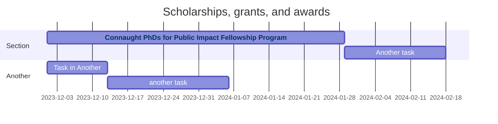
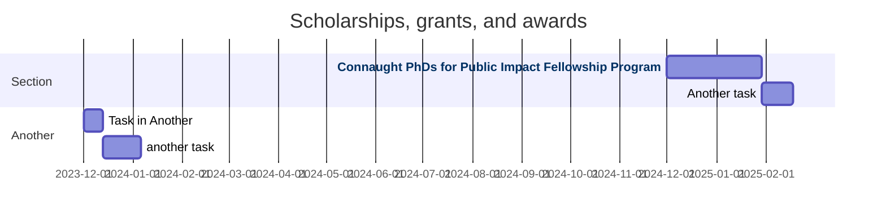

# Funding Opportunities

## 2024

## 2025

## Database

### Connaught PhDs for Public Impact Fellowship Program

https://www.sgs.utoronto.ca/awards/connaught-phds-for-public-impact-fellowship-program/

$12,500/year ($10,000 top-up? + $2,500 allowance) 

Deadline to SGS is likely end of January 2025. Application round likely to open in November-December 2024.

> Application Form Components: 
> 
> -   Identifying information: Name of applicant, student number, home unit(s) and contact information; Name of supervisor(s) and contact information; Name of Graduate Chair / Coordinator and contact information; 
> -   Summary of proposed public scholarship initiative (maximum 500 words); 
> -   Description of impact of proposed public scholarship initiative (maximum 250 words); 
> -   Explanation of how public scholarship initiative will address EDI considerations (maximum 250 words); 
> -   Description of circumstances that have prepared applicant for the proposed public scholarship initiative (maximum 250 words); 
> -   Description of how applicant will advance public scholarship initiative over the year of the fellowship (maximum 250 words); 
> -   Description of the current funding package and research and professional development funds available, and proposed use of the $2,500 allowance (maximum 250 words); 
> -   Description of any special circumstances that have affected the applicant's trajectory, e.g., illness, leaves, child or elder care (optional; maximum 250 words); 
> -   Curriculum vitae; 
> -   Statement of support from supervisor, co-signed by Graduate Chair / Coordinator, which includes a statement that the student is in good academic standing (template form provided).
